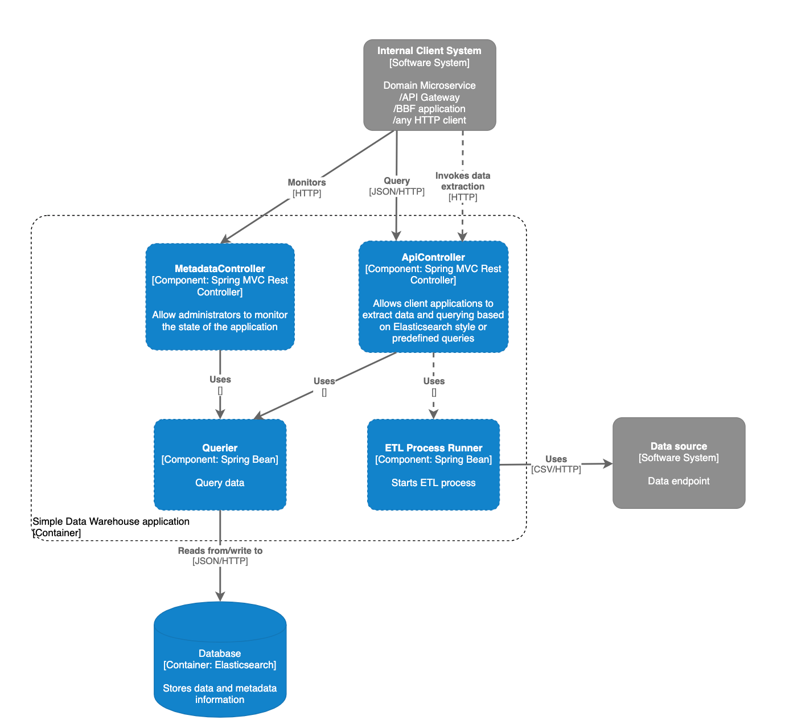

### 1. The container diagram (C4 level 2).


### 2. The component diagram (C4 level 3).



### 3. Running the application.

#### 3.1 With Docker.

- Run with `docker-compose build && docker-compose up`.

- Maven dependencies are cached. 

#### 3.2. Without docker.

- Be sure an Elasticsearch instance is up and running on `localhost:9200` (ie use a docker image or a shared instance).

- Build the application with Maven and run without any profile (it means `default`).

#### 3.3 On Heroku.

- Heroku doesn't support `docker-compose`.

- Be sure a SearchBox (Heroku Elasticsearch service) is connected to your Heroku application (`SEARCHBOX_URL` environment variable is provided).

- Set `SPRING_PROFILES_ACTIVE` on Heroku to `heroku`.

- Deploy from your repository and use `Procfile`.

### 4. Project related links.

* **The application demo**: https://simple-data-warehouse-dev.herokuapp.com

* **Swagger documentation**: https://simple-data-warehouse-dev.herokuapp.com/swagger-ui/index.html?configUrl=/v3/api-docs/swagger-config

* **The repository**: https://github.com/maciejscislowski/simple-data-warehouse

### 5. Using the API.

#### 5.1 Predefined queries.
 
- You can use Elasticsearch syntax in dates parameters; 
 
- Pagination parameters (optionals, numbers): size, from;

##### Total clicks endpoint

- `GET` https://simple-data-warehouse-dev.herokuapp.com/api/v1/total-clicks

- Optional parameters: datasource, fromDaily, toDaily;

- Example: 
```
curl -G \
    --data-urlencode "datasource=Google Ads" \
    --data-urlencode "fromDaily=now-20M/M" \
    --data-urlencode "toDaily=now" \
    --data-urlencode "size=3" \
    https://simple-data-warehouse-dev.herokuapp.com/api/v1/total-clicks
```

##### Impressions endpoint

- `GET` https://simple-data-warehouse-dev.herokuapp.com/api/v1/impressions

- Example:
```
curl -G \
    --data-urlencode "size=5" \
    https://simple-data-warehouse-dev.herokuapp.com/api/v1/impressions
```

##### CTR endpoint

- `GET` https://simple-data-warehouse-dev.herokuapp.com/api/v1/ctr

- Optional parameters: datasource, campaign;

- Example:
```
curl -G \
    --data-urlencode "datasource=Google Ads" \
    --data-urlencode "campaign=Remarketing" \
    --data-urlencode "size=1" \
    https://simple-data-warehouse-dev.herokuapp.com/api/v1/ctr
```

#### 5.2. The generic endpoint.

- `POST` https://simple-data-warehouse-dev.herokuapp.com/api/v1/query

- An optional parameter: JSON query based on Elasticsearch syntax;

- Example:
```
curl -H "Content-Type: application/json" -d '{"query":{"bool":{"must":[{"term":{"datasource.keyword":"Google Ads"}},{"range":{"daily":{"gte":"now-20M/M","lte":"now"}}}]}},"aggs":{"group_by_datasources":{"terms":{"field":"datasource.keyword"},"aggs":{"clicks_per_datasource":{"sum":{"field":"clicks"}}}}},"size":1}' https://simple-data-warehouse-dev.herokuapp.com/api/v1/query
```

#### 5.3. The ETL data process endpoint.

##### Starting the ETL data process

- `POST` https://simple-data-warehouse-dev.herokuapp.com/api/v1/extract?url=<CSV_DATA_FILE_URL>

- Example:
```
curl https://simple-data-warehouse-dev.herokuapp.com/api/v1/extract?url=<CSV_DATA_FILE_URL>
```

##### Administrative application state endpoint (ie status of the ETL process)

- `GET` https://simple-data-warehouse-dev.herokuapp.com/metadata

```
curl -G https://simple-data-warehouse-dev.herokuapp.com/metadata
```
