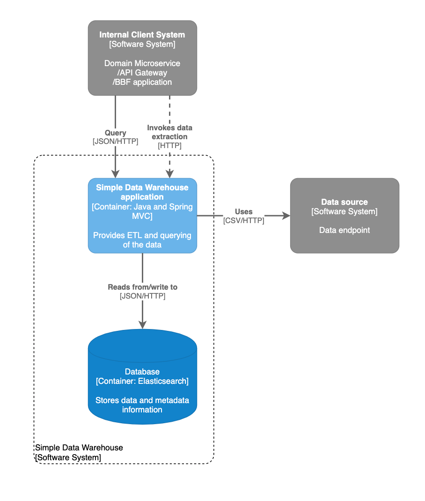

### 1. Container diagram (C4 level 2).

### 2. Run locally with docker.

- Run with `docker-compose build && docker-compose up`.

- Maven dependencies are cached. 

### 3. Run locally without docker.

- Be sure an Elasticsearch instance is up and running on `localhost:9200` (ie use a docker image or a shared instance).

- Build the application with Maven and run without any profile (it means `default`).

### 4. Run on Heroku.

- Heroku doesn't support `docker-compose`.

- Be sure a SearchBox (Heroku Elasticsearch service) is connected to your Heroku application (`SEARCHBOX_URL` environment variable is provided).

- Set `SPRING_PROFILES_ACTIVE` on Heroku to `heroku`.

- Deploy from your repository and use `Procfile`.

#### 4.1. Important links.

* **The application demo**: https://simple-data-warehouse-dev.herokuapp.com

* Swagger (REST API documentation): https://simple-data-warehouse-dev.herokuapp.com/swagger-ui/index.html?configUrl=/v3/api-docs/swagger-config

* **The repository**: https://github.com/maciejscislowski/simple-data-warehouse

#### 4.1. Example possible queries.

* Total clicks: `GET` https://simple-data-warehouse-dev.herokuapp.com/api/v1/total-clicks?datasource=Google%20Ads&fromDaily=now-20M/M&toDaily=now&size=1

* Impressions: `GET` https://simple-data-warehouse-dev.herokuapp.com/api/v1/impressions?size=2

* CTR: `GET` https://simple-data-warehouse-dev.herokuapp.com/api/v1/ctr?datasource=Google%20Ads&campaign=Remarketing&size=1

* A generic query (with Elasticsearch query as the body): `POST` `https://simple-data-warehouse-dev.herokuapp.com/api/v1/query`

* A generic query with cURL `curl -H "Content-Type: application/json" -d '{"query":{"bool":{"must":[{"term":{"datasource.keyword":"Google Ads"}},{"range":{"daily":{"gte":"now-20M/M","lte":"now"}}}]}},"aggs":{"group_by_datasources":{"terms":{"field":"datasource.keyword"},"aggs":{"clicks_per_datasource":{"sum":{"field":"clicks"}}}}},"size":1}' https://simple-data-warehouse-dev.herokuapp.com/api/v1/query`
